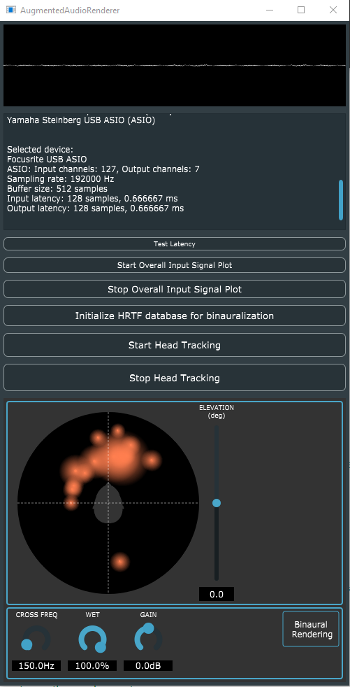
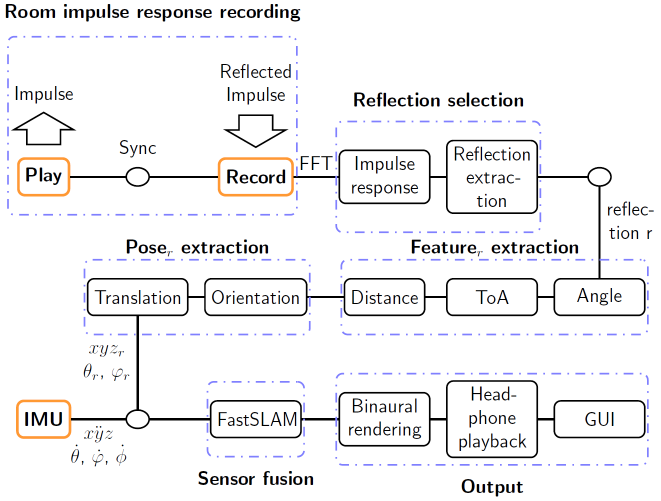

# Inertial-Acoustic-SLAM

### Content
Inertial-acoustic SLAM implementation usable for localization of a robot mannequin while mapping the surrounding boundaries.

### Source-Code folder structure:

1. "src/juce/src" folder contains platform independent JUCE framework C++ 14 code for GUI elements and the user interface to control binaural mixed audio playback based on the robot position in real-time. The JUCE code also allows to read x-io technologies NGIMU inertial measurement unit data via Serial Interface and Vicon Nexus measurement data for ground truth position calculation.

2. "src/sdk" folder contains C-code to perform inertial-acoustic SLAM on Windows. It allows to send and record sine-sweeps using Steinberg ASIO or Windows audio drivers, convolve the output with minimal latency using the Intel MKL library, extract impulse responses, process the impulse responses, map boundaries and calculate the position of a robot equiped with microphones.

### Installation:
The program can be run by loading JUCE Projucer.exe in "src\juce\lib\JUCE".
Then open the JUCE project via File/Open -> "src\juce\src\AugmentedAudioRenderer.jucer".

If not automatically set, following additional steps have to be taken:

1. The JUCE Global Paths have to be defined in Projucer via "File/Global Paths" to include the JUCE library located in "src\juce\lib\".
2. The JUCE project settings have to be adapted to link to the correct Header Search Paths in the repository. 
3. The Visual Studio Export settings have to be adapted to link to the correct Header Search Paths in the repository. 
4. The Visual Studio Export settings have to be adapted to link to the correct Extra Library Search Paths in the repository. 

It is in particular required to install the Intel MKL library fast FFT calculation on Windows and then link the installation path. The version 2019.5.281 is used which can be acquired via NuGet.

### Program structure:
After pressing the start button in the GUI following function blocks are run:

If elements of the program are re-used please cite: 
F. Pfreundtner, J. Yang and G. Sörös, "(W)Earable Microphone Array and Ultrasonic Echo Localization for Coarse Indoor Environment Mapping," ICASSP 2021 - 2021 IEEE International Conference on Acoustics, Speech and Signal Processing (ICASSP), 2021, pp. 4475-4479, doi: 10.1109/ICASSP39728.2021.9414356